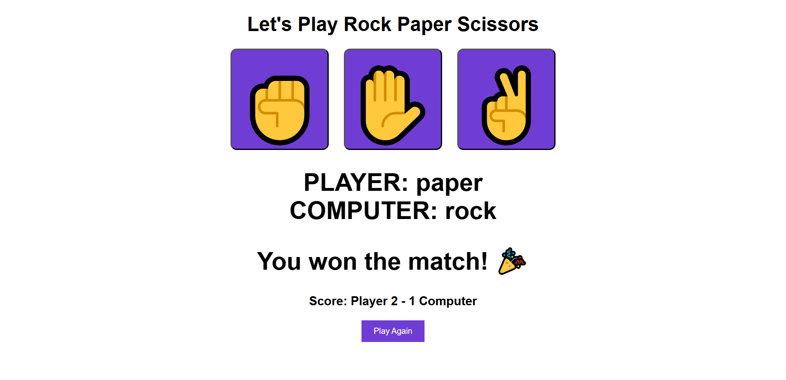

# ✊✋✌ Rock Paper Scissors Game

A fun and interactive **Rock Paper Scissors** game built using **HTML, CSS, and JavaScript**. Play against the computer and try to win a best-of-three match!

## 🖥️ Live Demo

> [Click here to play the game!](https://rock-paper-scissors-5st9sq8qn-cheruvu-shriyas-projects.vercel.app/)

---

## 🎮 How to Play

- Choose **Rock (✊), Paper (✋), or Scissors (✌)** by clicking one of the buttons.
- The computer will randomly choose a move.
- The result will be displayed along with the running score.
- The game ends when either player or computer wins 2 rounds.
- Click **"Play Again"** to restart the game.

---

## 🧠 Game Rules

- Rock beats Scissors
- Scissors beats Paper
- Paper beats Rock
- If both select the same, it's a tie!

---

## 🛠️ Technologies Used

- **HTML5** – for structuring the game
- **CSS3** – for styling and layout
- **JavaScript** – for game logic and dynamic interactions

---

## 📸 Interface Preview

